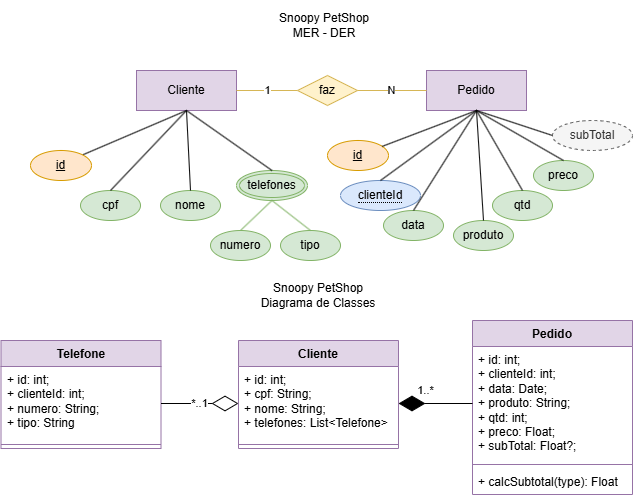
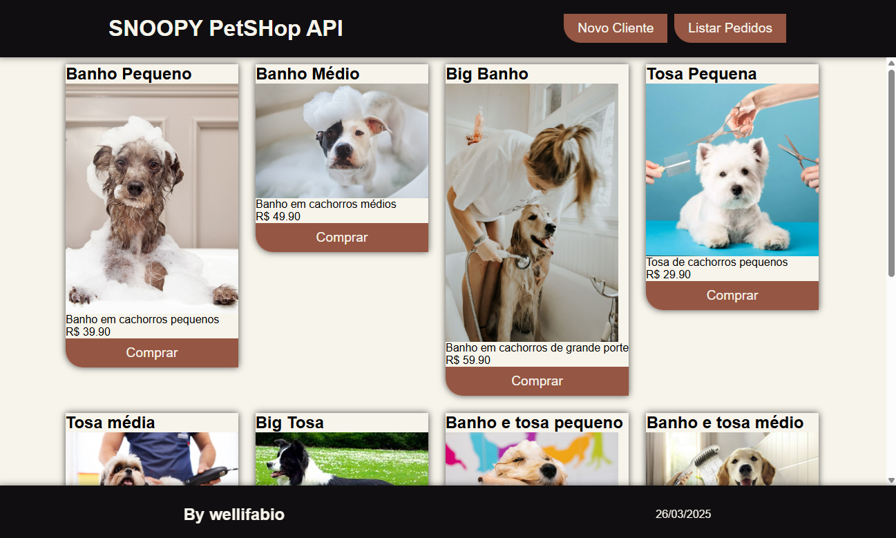
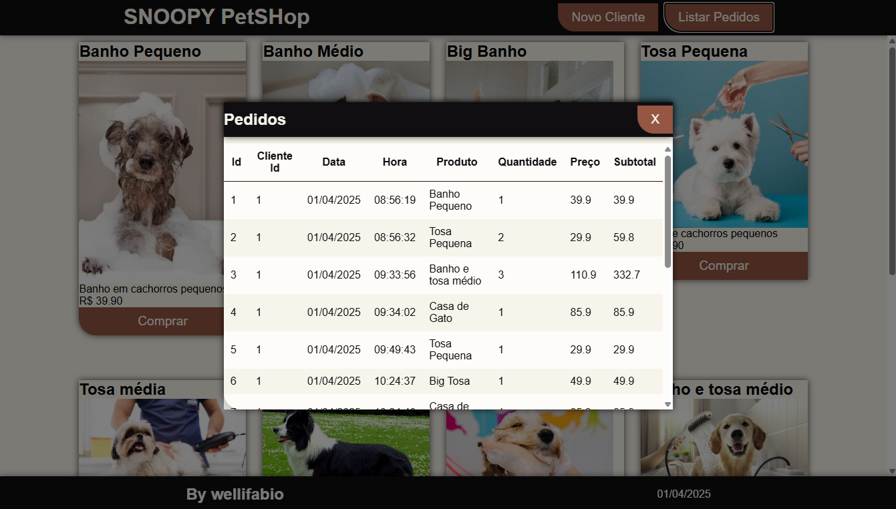
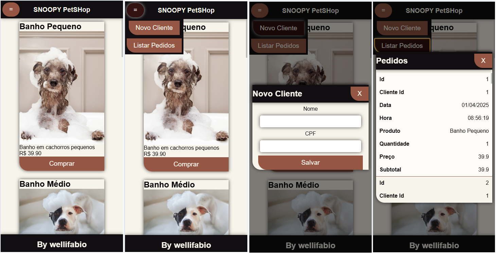

# SNOOPY PetSHop
- Projeto full stack para estudos
    - Back-End
        - ORM Prisma com MySQL no Node.JS
        - Calculo nos controllers
        - Where, Select e Include
    - Front-End (Vanilla JS)
        - Modais
        - @media query
        - fetch API
        - Tabela zebrada e responsiva
        - Cards
## Tecnologias
- Node.JS
- VsCode
- XAMPP
- Insomnia
## Passo a passo de como testar
### Back-End
- 1 Clone este repositório
- 2 Abra com VsCode, abra um terminal **CTRL + '** cmd ou bash, navegue até a pasta ./api e escute os seguintes comandos
```bash
cd api
npm install
```
- 3 Crie o arquivo **.env** na pasta api contendo as variáveis de ambiente
```js
DATABASE_URL="mysql://root@localhost:3306/petshop?schema=public&timezone=UTC"
PORT=5000
```
- 4 Abra o XAMPP Control Panel e de start no MySQL
- 5 No terminal instale o prisma globalmente e execute o comando da migração
```bash
npm i prisma -g
npx prisma migrate dev --name init
```
- 6 Execute a API e faça os testes com o **Insomnia**
```bash
npm start
# ou
npx nodemon
```
### Front-End
- 7 Para executar o Front-end, navegue até a pasta web e abra o **index.html** com o Live Server do VsCOde.

|MER x DER e Diagrama de Classes|
|-|
||

|Wireframes|
|-|
||
||
||